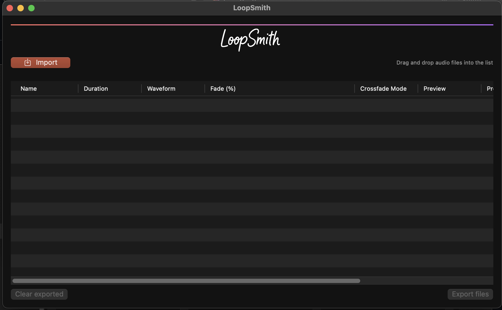

# LoopSmith

LoopSmith is a macOS application for creating seamless audio loops. It offers an intuitive drag & drop interface, live preview of cross‑fades and batch export to WAV or AIFF formats.

## Features
- 🎵 Drag & drop interface for easy file management
- 🔄 Real-time preview of crossfades
- 🎚️ Adjustable fade percentage
- 🔀 Multiple crossfade modes
- 📦 Batch export to WAV or AIFF
- 🖥️ Native macOS application

## How it Works
1. Import audio files using **Import** or by dropping them onto the list.
2. Adjust the fade percentage and choose a crossfade mode.
3. Preview the loop and export the processed files.

## Download
[Download Latest Version](https://github.com/lescurej/LoopSmith/releases/latest)

## Requirements
- macOS 11.0 or later
- 100MB of free disk space

## Support
- [Report Issues](https://github.com/lescurej/LoopSmith/issues)
- [Documentation](https://github.com/lescurej/LoopSmith/wiki)

Below is a sample view of the interface.

